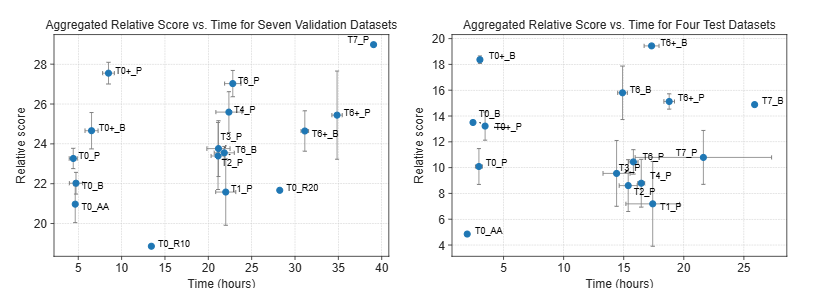

# EG-ENAS

This is the repository of EG-ENAS, an efficient and generalizable Neural Architecture Search (NAS) framework for Image Classification based on evolutionary computation, which reuses available pretrained weights and uses proxies to reduce redundant computations, which uses a small version of the RegNet search space and reuses available prior knowledge across tasks and  proxies to reduce redundant computations. It aligns with the constraints set by the [NAS Unseen Data Challenge](https://github.com/Towers-D/NAS-Unseen-Datasets). The main code structure and pipeline (Preprocessing-NAS-Trainer) are based on the code from this competition ([Link](https://github.com/Towers-D/NAS-Comp-Starter-Kit)), following a consistent framework that is easy for other researchers and users to adopt. Experimental results show that our low-cost (T0) and full EG-ENAS (T6) configurations consistently achieve robust performance across eleven datasets, outperforming Random Search (T1) and simple Evolutionary NAS (T2) with competitive results in under 24 hours on seven validation datasets, reaching state-of-the-art accuracy on one and surpassing the 2023 Unseen NAS Challenge top score on four.



*Figure 1: Total Relative score versus time in hours for each study on seven validation datasets and four test datasets*

## Installation
Follow these steps to set up the project in a virtual environment:

1. **Clone the repository**:
   ```bash
   git clone https://github.com/ankilab/EG-ENAS.git
   cd EG-ENAS
   ```

2. **Create a virtual environment** (optional but recommended):
   ```bash
   python3 -m venv .venv
   ```

3. **Activate the virtual environment**:
   - **On Windows**:
     ```bash
     .venv\Scripts\activate
     ```
   - **On macOS and Linux**:
     ```bash
     source .venv/bin/activate
     ```

4. **Install the required dependencies**:
   ```bash
   pip install -r requirements.txt
   ```

5. **Deactivate the virtual environment** (when finished, optional):
   ```bash
   deactivate
   ```

Now, your environment is set up, and you are ready to run the project.

## Usage 

To use our NAS framework, create a folder named **datasets** in the root directory. This folder should contain the image classification datasets to be tested. You will also need to modify the script file to specify the `save_folder` and the `mode` you want to run.

### Datasets Structure

Each dataset should have its own subfolder within **datasets** containing the following files. For reference, see examples in the [NAS Unseen Data Challenge](https://github.com/Towers-D/NAS-Unseen-Datasets):

- `metadata`
- `test_x.npy`
- `test_y.npy`
- `train_x.npy`
- `train_y.npy`
- `valid_x.npy`
- `valid_y.npy`

#### Metadata

The `metadata` file should be a dictionary with the following fields. Here’s an example from the **AddNIST** dataset [2]:

```json
{
  "num_classes": 20,
  "input_shape": [50000, 3, 28, 28],
  "codename": "Adaline",
  "benchmark": 89.850
}
```

### Modes
The names of the tests combine **(Mode + AugmentationStrategy)** and include a "+" if the extended search space is used. Below is a description of each mode and augmentation selection strategy:

- **T0:** Low-cost NAS. This approach uses a ranking regressor to select the model most likely to achieve the highest accuracy from 100 sampled models. The selected model is then fully trained.
- **T1:** Random search. Samples 3 generations of random models from the RegNet space, trains each model for 5 epochs, and selects the best model based on validation accuracy. The selected model is then fully trained.
- **T2:** Evolutionary NAS. Performs NAS across 3 generations using selection and genetic operators as described in the previous section.
- **T3:** Evolutionary NAS with ranking regressor-based initialization for the first-generation population.
- **T4:** Evolutionary NAS with weight transfer and inheritance.
- **T6:** EG-ENAS. Evolutionary NAS with ranking regressor, weight transfer, and inheritance.
- **T7:** Similar to T6, but trains each model for 10 epochs instead of 5 during the search.

### Augmentation Selection Strategies
Methods tested to select which method to use to select the most suitable transform for each dataset or which transform to use.

- **AA:** AutoAugment transform.
- **P:** Selection using Fisher and Jacob_cov zero cost proxies.
- **B:** Basic transform composed of RandomErasing, RandomCrop, and RandomHorizontalFlip.
- **R_20:** Train a ResNet18 model with all possible augmentations for 20 epochs.
- **R_10:** Train a ResNet18 model for 10 epochs.


## Configuration
The base script for running experiments is located in the `scripts` folder and named `egenas_job_full_main.sh`. To execute this script, you need to specify the following arguments:

- **`save_folder`**: Path to the folder where trained models and results will be saved.
- **`mode`**: Specifies the EG-ENAS mode, ranging from `T0` to `T7`.
- **`augment`**: Augmentation selection method to use (e.g., AA, P, B, etc.).
- **`seed`**: Seed value (an integer or `None` if not used).
- **`pretrained_pool_path`**: Folder with pretrained RegNet models (str).
- **`only_processor`**: If just using data processing module for selecting the best augmentation (bool).

```bash
source <repo_folder>/.testvenv/bin/activate
cd <repo_folder>
make -f Makefile save_folder=<save_folder> \
        submission=egenas \
        mode=<mode> \
        augment=<augment> \
        seed=<seed> \
        pretrained_pool_path=<pretrained_pool_path> \
        all
deactivate
```

Replace `<repo_folder>`, `<save_folder>`, `<mode>`, `<augment>`, `<seed>` and `<pretrained_pool_path>` with your actual values. Add `only_processor=1` over "all" in case you just want to use the data processing module. 

<!-- ## Contact

 If you have any questions or need access to the ranking regressor models for the initial generation's population, as well as the pre-trained pool for initializing model weights, please feel free to reach out.

📧 [mateo.avila@fau.de](mailto:mateo.avila@fau.de) -->

## References

1. Geada, Rob, et al. "Insights from the Use of Previously Unseen Neural Architecture Search Datasets." Proceedings of the IEEE/CVF Conference on Computer Vision and Pattern Recognition. 2024. [Link](https://arxiv.org/abs/2404.02189)
2. Towers, David; Geada, Rob; Atapour-Abarghouei, Amir; McGough, Andrew Stephen (2023). AddNIST Dataset. Newcastle University. Dataset. https://doi.org/10.25405/data.ncl.24574354.v1