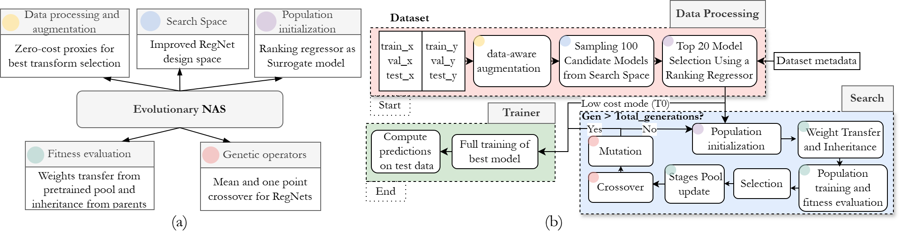
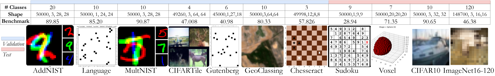
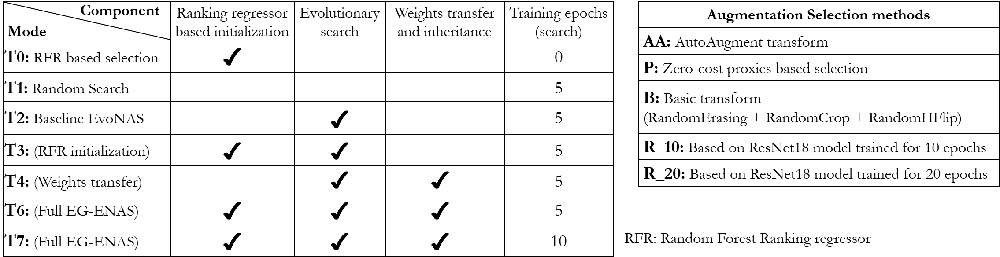

# EG-ENAS
Neural Architecture Search (NAS) has become a powerful method for automating the design of deep neural networks in various applications. Among the different optimization techniques, evolutionary approaches stand out for their flexibility, robustness, and capacity to explore diverse solutions. However, evaluating neural architectures typically requires training, making NAS resource-intensive and time-consuming. Additionally, many NAS methods lack generalizability, as they are often tested only on a small set of benchmark datasets. To address these two challenges, we propose EG-ENAS, a new efficient NAS framework based on evolutionary computation, which reuses available pretrained weights and uses proxies and surrogate models to reduce redundant computations.

It aligns with the constraints set by the [NAS Unseen Data Challenge](https://github.com/Towers-D/NAS-Unseen-Datasets). The main code structure and pipeline (Preprocessing-NAS-Trainer) are based on the code from this competition ([Link](https://github.com/Towers-D/NAS-Comp-Starter-Kit)), following a consistent framework that is easy for other researchers and users to adopt. Experimental results show that our low-cost (T0) and full EG-ENAS (T6) configurations consistently achieve robust performance across eleven datasets, outperforming Random Search (T1) and simple Evolutionary NAS (T2) with competitive results in under a 24-hour time budget on seven validation datasets. We achieve state-of-the-art accuracy on one and surpass the 2023 Unseen NAS Challenge top scores on four datasets.



*Figure 1: EG-ENAS Overview*

## Installation

### Google Colab
If you want an easy way to test our repo, you can use Google Colab with GPU and run the code in *notebooks/EG_ENAS*.ipynb. This works for our low-cost mode (T0) (~1 hour) and (T1-T3) (~4-8 hours) per dataset, or for finding the best augmentation for your dataset using our zero-cost selection method (P) with the *get_augmentations_rank.sh* script.

### Linux
Our pipeline runs on Linux with Python 3.10 or higher. Follow these steps to set up the project in a virtual environment:

1. **Clone the repository**:
   ```bash
   git clone https://github.com/ankilab/EG-ENAS.git
   cd EG-ENAS
   ```

2. **Create a virtual environment** (optional but recommended):
   ```bash
   python3 -m venv .venv
   ```

3. **Activate the virtual environment**:

   - **On macOS and Linux**:
     ```bash
     source .venv/bin/activate
     ```

4. **Install the required dependencies**:
   ```bash
   pip install -r requirements.txt
   ```

5. **Deactivate the virtual environment** (when finished, optional):
   ```bash
   deactivate
   ```

Now, your environment is set up, and you are ready to run the project.

## Usage 

### 1. Datasets
To use our NAS framework, add image classification datasets to be tested in the folder **datasets**. As a default example, we include the [Sokoto dataset](https://data.ncl.ac.uk/articles/dataset/Sudoku_Dataset/26976121/1) [3], which is small, novel, and was used in the NAS Unseen Data Challenge 2024.



#### Datasets Structure
Each dataset should have its own subfolder within **datasets** containing the following files. For reference, see examples in the [NAS Unseen Data Challenge](https://github.com/Towers-D/NAS-Unseen-Datasets):

- `metadata`
- `test_x.npy`
- `test_y.npy`
- `train_x.npy`
- `train_y.npy`
- `valid_x.npy`
- `valid_y.npy`

#### Metadata

The `metadata` file should be a dictionary with the following fields. Here’s an example from the **AddNIST** dataset [2]:

```json
{
  "num_classes": 20,
  "input_shape": [50000, 3, 28, 28],
  "codename": "Adaline",
  "benchmark": 89.850
}
```
You can download the datasets we used for validation from the [NAS Unseen Data Challenge](https://github.com/Towers-D/NAS-Unseen-Datasets) repository. Voxel dataset[4] that was used in the test datasets can be download [here](https://data.ncl.ac.uk/articles/dataset/Voxel_Dataset/26970223). 

### 2. Augmentation Selection Strategies
As we assume that the information of the dataset is not known in advance, we must select the most suitable augmentation for each specific dataset. We propose a method that uses zero-cost proxies **(P)** to evaluate multiple candidate augmentations (located in the **configs/augmentations** folder) and find an optimal augmentation for that specific dataset in just a few minutes. It is also possible to use AutoAugment (AA) or general transforms combination(B). 

### 3. Modes
We did ablation tests to check the effect of each component in our EG-ENAS. The names of the tests combine **(Mode + AugmentationStrategy)** and include a "+" if the extended search space is used (larger search space). Below is a description of each mode and augmentation selection strategy:

- **T0:** Our Low-cost NAS option. This approach uses a ranking regressor to select the model most likely to achieve the highest accuracy from 100 sampled models. The selected model is then fully trained.
- **T1:** Random search. Samples 3 generations of random models from the RegNet space, trains each model for 5 epochs, and selects the best model based on validation accuracy. The selected model is then fully trained.
- **T2:** Evolutionary NAS. Performs NAS across 3 generations using selection and genetic operators as described in the previous section.
- **T3:** Our EG-ENAS with ranking regressor-based initialization for the first-generation population of the evolutionary NAS.
- **T4:** Evolutionary NAS with weight transfer and inheritance.
- **T6:** full EG-ENAS. Evolutionary NAS with ranking regressor, weight transfer, and inheritance.
- **T7:** Similar to T6, but trains each model for 10 epochs instead of 5 during the search.

The components of these modes are illustrated in the figure below:


*Figure 2: EG-ENAS test modes and augmentation selection strategies*

### 4. Pretrained stages pool
For modes T4, T6, and T7, we use a weight transfer strategy for our RegNet search space from a pretrained pool of weights. This helps to boost the population training process. However, the pretrained pool weighs 54GB and can be downloaded here. The files and folders inside it must be placed in the *pretrained_pool* folder. The current file *pretrained_pool/df_blocks_pool.csv* contains only the information and metadata of the model weights and their locations but not the weights themselves.

We recommend starting the initial tests with the low-cost (T0) and T3 modes that don't require the pretrained weights.

## Configuration and Reproducibility  
We did our test in an A100 GPU, then times could change depending on the GPU used. 
The base scripts for running experiments are located in the `scripts` folder and are named after each mode. To reproduce **T0 with proxy-based (P) augmentation selection (T0_P)** for validation datasets (Table 1 in following section), follow these steps:  

### 1. Download Required Datasets  
Download the following datasets: [LaMelo](data.ncl.ac.uk/articles/dataset/Language_Dataset/24574729), [Gutenberg](data.ncl.ac.uk/articles/dataset/Gutenberg_Dataset/24574753), [Adaline](data.ncl.ac.uk/articles/dataset/AddNIST_Dataset/24574354), [Chester](data.ncl.ac.uk/articles/dataset/Chesseract_Dataset/24118743), [Sadie](data.ncl.ac.uk/articles/dataset/GeoClassing_Dataset/24050256), [Mateo](data.ncl.ac.uk/articles/dataset/MultNIST_Dataset/24574678), [Caitie](data.ncl.ac.uk/articles/dataset/CIFARTile_Dataset/24551539). Save each one in a separate subfolder inside the **datasets** directory. Remove any other folders or datasets inside **datasets** .  


### 2. Run the Experiment  
Once the datasets are in place, execute the script directly:  

```bash
./scripts/T0_P.sh
```  

If the script does not have executable permissions, grant them first:  

```bash
chmod +x scripts/T0_P.sh
```  

### 3. Understanding the Results  
- The test will copy the necessary functions and run in the **EGENAS_RESULTS** folder inside `EG-ENAS`.  
- Results will be displayed inline and saved in **EGENAS_RESULTS/evaluation**.  
- The best-selected augmentation method will be saved in .  

Inside the script, you can modify the random seed (default: `1`).  

### Important Notes  
- For **T4, T6, and T7**, you must download the pretrained weight pool as explained above.  
- Ensure that all dataset folders are correctly placed in **datasets** before running experiments.  

---

## Adding New Scripts  

If you want to test other **Mode + Augmentation Selection** combinations, specify the following arguments:  

```bash
source <repo_folder>/.testvenv/bin/activate
cd <repo_folder>
make -f Makefile save_folder=<save_folder> \
        submission=egenas \
        mode=<mode> \
        augment=<augment> \
        seed=<seed> \
        all
deactivate
```  

Replace `<repo_folder>`, `<save_folder>`, `<mode>`, `<augment>`, and `<seed>` with the appropriate values.  

---**EGENAS_RESULTS/augmentation_tests**

## Running Only Augmentation Selection  

If you only want to run the **data processing module** to evaluate the best augmentation method for your dataset using our zero-cost proxy-based selection, execute:  

```bash
./scripts/get_augmentations_rank.sh
```  

This will return the estimated ranking of augmentation methods in the **EGENAS_RESULTS/augmentation_tests**.  

## Results
**Table 1: Test Accuracy and Relative Scores for Validation Datasets**  
The first section summarizes eight of our studies (mean of three seeds), the second lists various CNN models, and the third compares NAS methods with the top scores from the NAS Unseen Data Challenge 2023[1]. Note that computation times for these scores are unavailable, limiting fair efficiency comparisons.

| Method            | Mean total time (↓) (seconds) | LaMelo | Gutenberg | Adaline | Chester | Sadie  | Mateo  | Caitie | Relative Score (↑) |
|------------------|-----------------------------|--------|-----------|---------|---------|--------|--------|--------|------------------|
| T0_P            | 2273                        | 87.08  | 47.87     | 95.53   | 61.70   | 96.46  | 94.28  | 72.92  | 25.76            |
| T0+_P          | 4364                        | 88.2   | 46.07     | 96.73   | 60.41   | **97.09** | 95.71  | 79.05  | 30.14            |
| T1_P            | 11319                       | 86.97  | 44.52     | 95.89   | 59.35   | 96.44  | 93.96  | 71.38  | 24.28            |
| T2_P            | 10862                       | 87.09  | 45.2      | 96.21   | 61.28   | 95.69  | 94.39  | 73.92  | 25.82            |
| T6_P            | 11736                       | 86.55  | 47.67     | 96.53   | 61.04   | 95.78  | 95.82  | 80.83  | 29.05            |
| T6+_P          | 17922                       | 88.06  | 47.02     | 96.37   | 59.11   | 96.93  | 95.12  | 80.18  | 29.04            |
| **ResNext**     | -                           | 93.97  | 40.3      | 91.42   | 55.15   | 89.9   | 90.57  | 46.23  | 11.11            |
| **ResNet18**    | -                           | **97.0** | 49.98     | 92.08   | 57.83   | 80.33  | 91.55  | 45.56  | 12.16            |
| **DenseNet**    | -                           | 84.57  | 43.28     | 93.52   | 59.6    | 94.21  | 92.81  | 51.28  | 13.98            |
| **MNASNet**     | -                           | 84.63  | 38.0      | 90.51   | 56.26   | 86.0   | 87.7   | 48.49  | -0.92            |
| **VGG16**       | -                           | 84.54  | 44.0      | 92.06   | 55.69   | 93.67  | 90.43  | 24.43  | 3.77             |
| **Best Competition** | -                     | 89.71  | **50.85** | 95.06   | 62.98   | 96.08  | 95.45  | 73.08  | 29.02            |
| **Bonsai-Net**  | -                           | 87.65  | 48.57     | **97.91** | 60.76   | 95.66  | 97.17  | 91.47  | 34.66            |
| **Random Bonsai** | -                         | 76.83  | 29.0      | 34.17   | **68.83** | 63.56  | 39.76  | 24.76  | -37.80           |
| **PC-DARTS**    | -                           | 90.12  | 49.12     | 96.6    | 57.20   | 94.61  | 96.68  | **92.28** | 33.37         |
| **DrNAS**       | -                           | 88.55  | 46.62     | 97.06   | 58.24   | 96.03  | **98.1** | 81.08  | 32.75            |
| **Random DARTS**| -                           | 90.12  | 47.72     | 97.07   | 59.16   | 95.54  | 96.55  | 90.74  | 34.10            |


## References

1. Geada, Rob, et al. "Insights from the Use of Previously Unseen Neural Architecture Search Datasets." Proceedings of the IEEE/CVF Conference on Computer Vision and Pattern Recognition. 2024. [Link](https://arxiv.org/abs/2404.02189)
2. Towers, David; Geada, Rob; Atapour-Abarghouei, Amir; McGough, Andrew Stephen (2023). AddNIST Dataset. Newcastle University. Dataset. https://doi.org/10.25405/data.ncl.24574354.v1
3. David Towers, Linus Ericsson, Amir Atapour-Abarghouei, Andrew Stephen McGough, and Elliot J Crowley. Sudoku Dataset, 9 2024.
4. David Towers, Linus Ericsson, Elliot J Crowley, Amir Atapour-Abarghouei, and An- 319
drew Stephen McGough. Voxel Dataset, 9 2024.